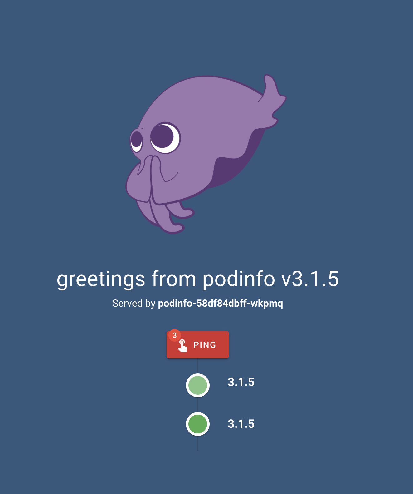

# flux

- getting started: [Get started - Flux](https://docs.fluxcd.io/en/latest/tutorials/get-started/)

## Getting started

### Prepare

flux の CLI をインストール

See: [fluxctl - Flux](https://docs.fluxcd.io/en/latest/references/fluxctl/)

```
brew install fluxctl
```

今回は kind 上で動作させた。

```
$ kind create cluster
```

```
$ kubectl create ns flux
```

```
export GHUSER="kaito2"
fluxctl install \
--git-user=${GHUSER} \
--git-email=${GHUSER}@users.noreply.github.com \
--git-url=git@github.com:${GHUSER}/flux-get-started \
--git-path=namespaces,workloads \
--namespace=flux | kubectl apply -f -
```

flux の SSH 鍵を GitHub に登録

```
$ fluxctl identity --k8s-fwd-ns flux
# 公開鍵が出力
```

GitHub repo 側で DeployKey として追加(Write Access も付与)

sample サービスに port-foward して アクセス

```
$ kubectl -n demo port-forward deployment/podinfo 9898:9898
...

$ open localhost:9898
```



[Update podinfo-dep.yaml · kaito2/flux-get-started@a8ee5a6](https://github.com/kaito2/flux-get-started/commit/a8ee5a6b583256e83ba73eb936236899086f17c9) の変更を作成

変更はデフォルトで 5 分おきに sync されるが今回は手動で sync

```
$ fluxctl sync --k8s-fwd-ns flux
Synchronizing with ssh://git@github.com/kaito2/flux-get-started
Revision of master to apply is a8ee5a6
Waiting for a8ee5a6 to be applied ...
Done.
```

再度アクセスして変更が反映されていることを確認

```
$ kubectl -n demo port-forward deployment/podinfo 9898:9898
...

$ open localhost:9898
```


